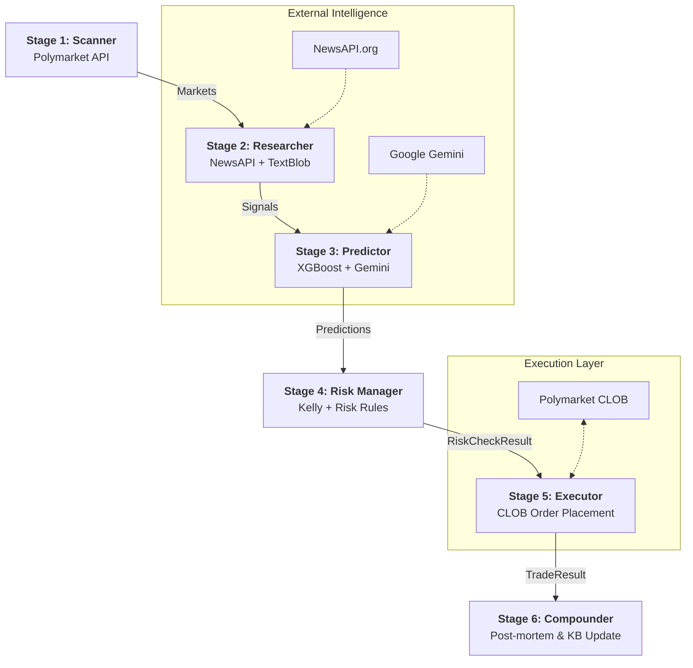

# Pipeline Data Flow & Architecture

Tài liệu này mô tả chi tiết quy trình hoạt động của **Predict Market Bot** từ lúc quét thị trường cho đến khi thực thi giao dịch.

## 1. Sơ đồ luồng (Pipeline Flow)

---

## 2. Chi tiết các bước (The 6 Stages)

### Stage 1: Market Scanner (`scanner.py`)
*   **Mục tiêu**: Tìm kiếm các cơ hội có thanh khoản cao.
*   **Nguồn dữ liệu**: Polymarket Gamma API (`/events`, `/markets`).
*   **Logic**:
    *   Lọc theo `min_liquidity` và `min_volume`.
    *   Làm giàu dữ liệu Spread từ CLOB API.
    *   Gán cờ `anomaly_flag` nếu Spread quá rộng hoặc Volume tăng đột biến.
*   **Đầu ra**: Danh sách các đối tượng `Market`.

### Stage 2: Market Researcher (`researcher.py`)
*   **Mục tiêu**: Thu thập thông tin bối cảnh bên ngoài.
*   **Công cụ**: NewsAPI, TextBlob (NLP).
*   **Logic**:
    *   Trích xuất từ khóa từ câu hỏi thị trường.
    *   Tìm kiếm tin tức và phân tích **Sentiment Polarity** (từ -1.0 đến +1.0).
    *   Tính toán độ liên quan (`relevance`) dựa trên vị trí keyword trong bài báo.
*   **Đầu ra**: Bản đồ tín hiệu `Signal` theo từng thị trường.

### Stage 3: Market Predictor (`predictor.py`)
*   **Mục tiêu**: Tính toán xác suất thực (p_model).
*   **Công cụ**: XGBoost (Statistical), Gemini (Expert Calibration).
*   **Logic**:
    *   **XGBoost**: Sử dụng vector 8 đặc trưng để dự đoán xác suất gốc.
    *   **Gemini**: Đọc tin tức mô tả từ Stage 2 để điều chỉnh (calibrate) xác suất.
    *   **Confidence**: Tính toán độ tự tin dựa trên tính thanh khoản và mật độ tin tức.
*   **Đầu ra**: Đối tượng `Prediction` chứa `edge` (p_model - p_market).

### Stage 4: Risk Manager (`risk_manager.py`)
*   **Mục tiêu**: Bảo vệ vốn và tính toán size lệnh.
*   **Kiểm tra (5 Risk Checks)**:
    1.  **Edge Check**: Phải lớn hơn `EDGE_THRESHOLD` (thường 4%).
    2.  **Kelly Sizing**: Tính toán % vốn tối ưu (Fractional Kelly).
    3.  **Exposure Limit**: Không vượt quá tổng mức phơi nhiễm danh mục.
    4.  **VaR Limit**: Kiểm soát rủi ro biến động giá hàng ngày.
    5.  **Drawdown Check**: Tự động dừng nếu tài khoản giảm quá ngưỡng (ví dụ 8%).
*   **Đầu ra**: `RiskCheckResult` (Pass/Fail + Suggested Size).

### Stage 5: Order Executor (`executor.py`)
*   **Mục tiêu**: Đưa lệnh vào thị trường.
*   **Giao thức**: Polymarket CLOB (Central Limit Order Book).
*   **Logic**:
    *   Quản lý khóa riêng (Private Key) an toàn.
    *   Đặt lệnh (Limit Order) và theo dõi trạng thái khớp lệnh.
*   **Đầu ra**: `TradeResult`.

### Stage 6: Compounder (`compounder.py`)
*   **Mục tiêu**: Học tập từ sai lầm và thành công.
*   **Logic**:
    *   Lưu trữ kết quả giao dịch vào JSON Knowledge Base.
    *   Phân tích sự sai lệch giữa dự đoán và kết quả thực tế.
    *   Cung cấp dữ liệu để huấn luyện lại XGBoost trong tương lai.

---

## 3. Kiến trúc Core (`core/`)
*   **models.py**: Định nghĩa các Dataclass thống nhất (Market, Signal, Prediction, Order, v.v.).
*   **formulas.py**: Thư viện chứa 12 công thức toán học "bất biến" (Kelly, Brier Score, Sharpe Ratio, v.v.).

## 4. Cách thức vận hành (`orchestrator.py`)
Đóng vai trò là "Nhạc trưởng", điều phối dữ liệu chảy qua 6 Stage theo thứ tự tuần tự và xử lý lỗi (Exception Handling) để bot không bị treo khi một API gặp sự cố.
