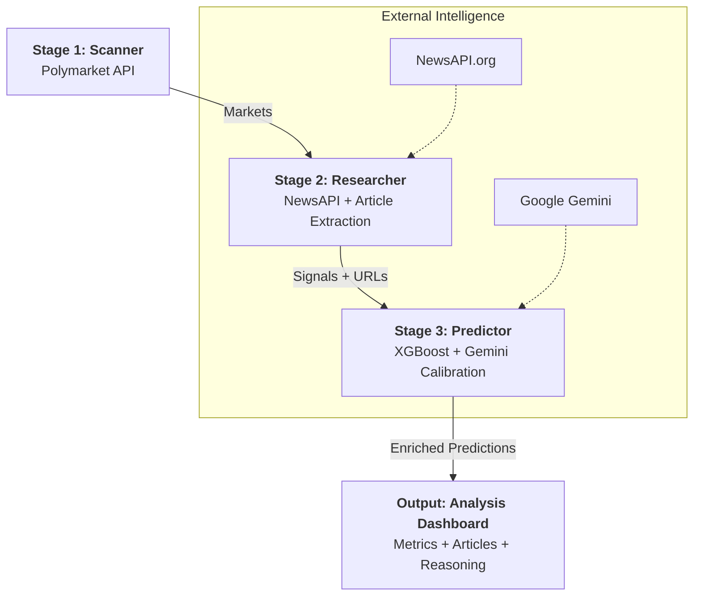

# Pipeline Data Flow & Architecture

Tài liệu này mô tả chi tiết quy trình hoạt động của **Predict Market Bot** từ lúc quét thị trường cho đến khi đưa ra dự báo chuyên sâu.

## 1. Sơ đồ luồng (Pipeline Flow)

---

## 2. Chi tiết các bước (The 3 Stages)

### Stage 1: Market Scanner (`scanner.py`)
*   **Mục tiêu**: Tìm kiếm thị trường theo Slug hoặc quét cơ hội thanh khoản.
*   **Logic**:
    *   Lọc theo `min_liquidity` và `min_volume`.
    *   Hỗ trợ `fetch_by_slug` để phân tích đích danh một sự kiện từ URL.
*   **Đầu ra**: Danh sách các đối tượng `Market`.

### Stage 2: Market Researcher (`researcher.py`)
*   **Mục tiêu**: Thu thập tin tức và link bài báo liên quan.
*   **Logic**:
    *   Tìm kiếm tin tức thời gian thực qua NewsAPI và DuckDuckGo.
    *   Phân tích **Sentiment** và trích xuất **Source URL**.
*   **Đầu ra**: Bản đồ tín hiệu `Signal` chứa link bài báo.

### Stage 3: Market Predictor (`predictor.py`)
*   **Mục tiêu**: Tính toán xác suất thực và giải thích lý do.
*   **Logic**:
    *   **XGBoost**: Dự đoán xác suất dựa trên các chỉ số on-chain.
    *   **Gemini Calibration**: Sử dụng LLM để đọc tin tức và đưa ra **Reasoning** (lý giải dự đoán).
*   **Đầu ra**: Đối tượng `Prediction` giàu thông tin.

---

## 3. Cách thức vận hành (`orchestrator.py`)
Đóng vai trò điều phối 3 stage đầu tiên của pipeline, thu thập toàn bộ kết quả phân tích (Signals, Predictions, Reasoning) và trả về thông qua API/SSE để hiển thị trên Dashboard.
